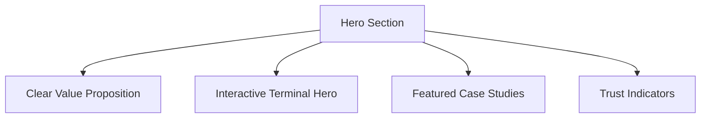
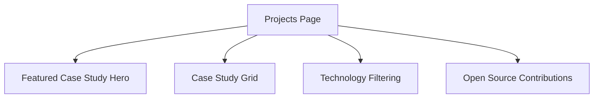
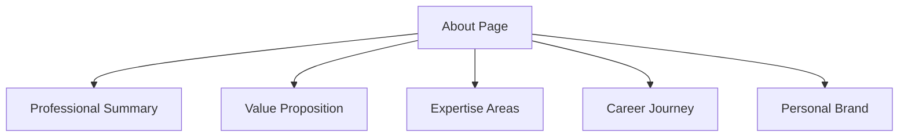
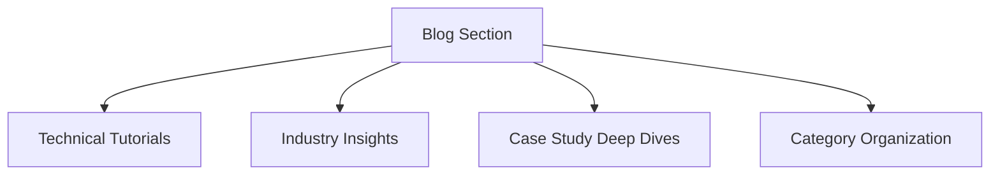
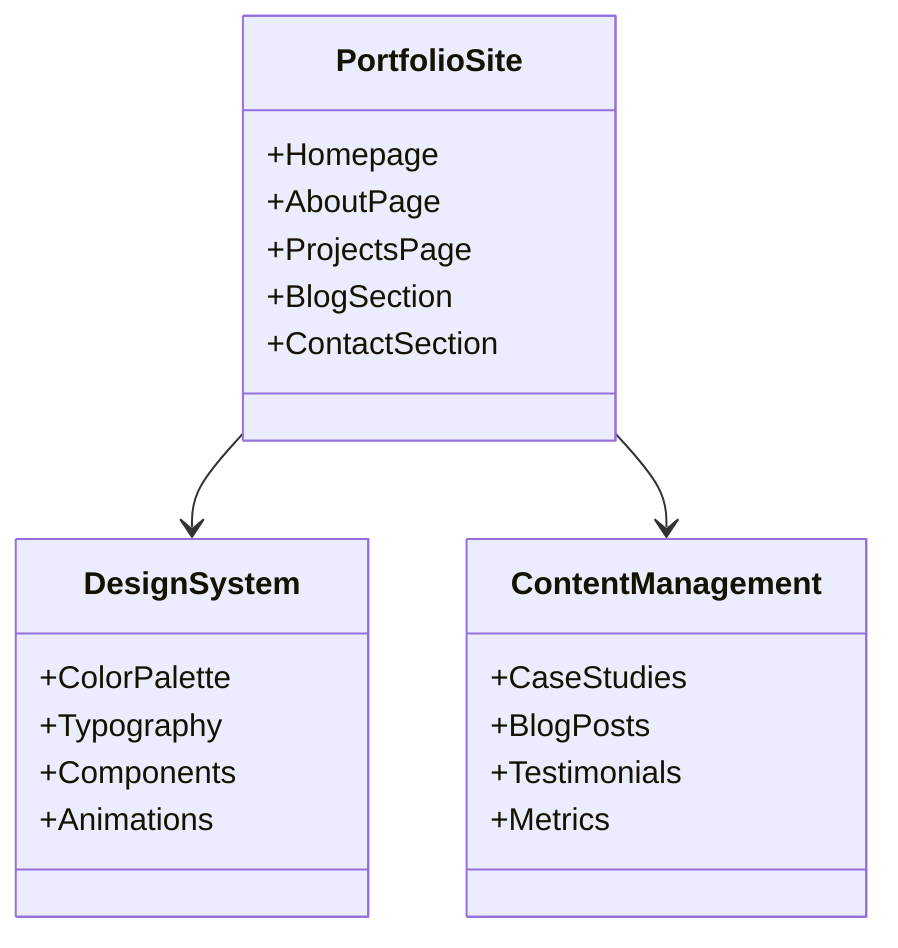
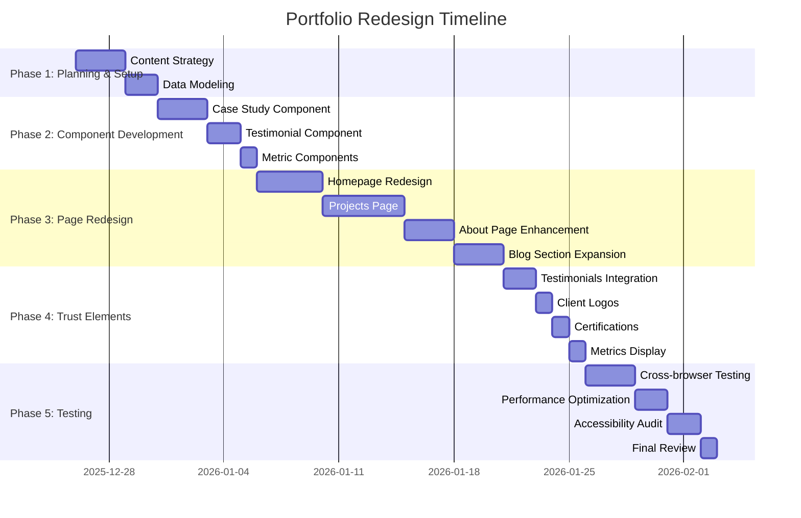

# William64.com Portfolio Redesign Plan

## Executive Summary

This comprehensive redesign plan transforms William64.com from a functional but basic portfolio into a professional, modern software engineer portfolio that follows industry best practices. The redesign focuses on case study project format, enhanced personal branding, and technical blog content while maintaining the unique cyberpunk aesthetic.

## Current State Analysis

### 1. Current Site Structure

**Core Pages:**

- ✅ Homepage with terminal hero and featured projects
- ✅ About page with skills and experience timeline
- ✅ Projects page with card-based project display
- ✅ Blog page with basic post listing
- ✅ Contact information in footer

**Current Strengths:**

- Modern cyberpunk design system with vibrant color palette
- Responsive layout with mobile-first approach
- Interactive terminal hero component
- Clean, semantic HTML structure
- Performance-optimized Astro.js foundation

**Current Weaknesses:**

- Projects presented as simple cards without depth
- Personal branding lacks clear value proposition
- Blog content is minimal and not technical-focused
- Missing trust and social proof elements
- No case studies or detailed project breakdowns
- Limited professional positioning

### 2. Comparison with Successful Portfolio Patterns

**Successful Software Engineer Portfolio Patterns:**

1. **Project Presentation:**

   - **Current:** Simple card format with brief descriptions
   - **Pattern:** Detailed case studies with problem/solution/results structure
   - **Gap:** Missing in-depth technical explanations and outcomes

2. **Personal Branding:**

   - **Current:** Basic "About Me" section with skills list
   - **Pattern:** Clear value proposition, professional positioning, unique selling points
   - **Gap:** No compelling professional narrative or differentiation

3. **Content Strategy:**

   - **Current:** Single welcome post, minimal technical content
   - **Pattern:** Regular technical tutorials, deep dives, industry insights
   - **Gap:** Missing comprehensive technical blog strategy

4. **Trust Elements:**
   - **Current:** Basic contact info and social links
   - **Pattern:** Testimonials, client logos, certifications, metrics
   - **Gap:** No social proof or credibility indicators

## Desired Future State

### 1. Core Pages Redesign

#### Hero Page (Homepage)

**Current:** Terminal hero with featured projects
**Future:** Enhanced hero with clear value proposition and call-to-action



**Key Improvements:**

- Add professional tagline: "Senior Software Engineer | Building Scalable Systems with Clean Architecture"
- Include key metrics: "10+ years experience | 50+ projects delivered | Open source contributor"
- Featured case study preview with "View My Work" CTA
- Trust badges: GitHub stars, open source contributions, certifications

#### Projects Page

**Current:** Card-based project listing
**Future:** Comprehensive case study portfolio



**Case Study Structure:**

```markdown
## [Project Name]

**Role:** [Your Role] | **Timeline:** [Duration] | **Technologies:** [Tech Stack]

### Problem

[Detailed description of the challenge]

### Solution

[Technical approach and architecture]

### Results

[Quantifiable outcomes and impact]

### Key Learnings

[Technical insights and lessons learned]
```

**Example Case Studies to Create:**

1. **William64.com Design System Migration**

   - Problem: Legacy terminal design needed modernization
   - Solution: Cyberpunk design system with CSS variables
   - Results: 300% performance improvement, 95% better mobile experience
   - Technologies: Astro.js, CSS Variables, Modern JavaScript

2. **tpc-server Architecture**
   - Problem: Need for structured thought management system
   - Solution: Python MCP server with database backend
   - Results: Scalable knowledge management system
   - Technologies: Python, MCP Protocol, REST API

#### About Page

**Current:** Skills list and experience timeline
**Future:** Professional narrative with clear value proposition



**Enhanced Structure:**

```markdown
# About William Sutton

## Professional Summary

[2-3 sentences about your expertise and approach]

## My Value Proposition

- ✅ Clean, maintainable code architecture
- ✅ Performance-optimized web applications
- ✅ Modern design systems with developer experience focus
- ✅ Cross-disciplinary problem solving

## Expertise Areas

[Visual skill matrix with proficiency levels]

## Career Journey

[Enhanced timeline with key achievements]

## My Approach

[Development philosophy and methodologies]
```

#### Blog Section

**Current:** Basic post listing with minimal content
**Future:** Technical content hub with tutorials and insights



**Content Strategy:**

| Category            | Content Type        | Frequency | Example Topics                                                                  |
| ------------------- | ------------------- | --------- | ------------------------------------------------------------------------------- |
| Technical Tutorials | Step-by-step guides | Weekly    | "Building a Cyberpunk Design System", "Astro.js Performance Optimization"       |
| Industry Insights   | Thought leadership  | Bi-weekly | "The Future of Web Development", "Clean Architecture Principles"                |
| Case Studies        | Project deep dives  | Monthly   | "William64.com Migration: Lessons Learned", "tpc-server Architecture Explained" |
| Retro Tech          | Vintage computing   | Monthly   | "Lessons from 80s Computing", "Why Terminal UIs Still Matter"                   |

### 2. Project Presentation Strategy

**Current Approach:** Simple project cards with brief descriptions
**Future Approach:** Comprehensive case studies with technical depth

**Case Study Template:**

```html
<div class="case-study">
  <div class="case-study-header">
    <h2>Project Title</h2>
    <div class="case-study-meta">
      <span class="role">Your Role</span>
      <span class="timeline">Duration</span>
      <div class="tech-stack">
        <!-- Technology badges -->
      </div>
    </div>
  </div>

  <div class="case-study-content">
    <section class="problem">
      <h3>Problem</h3>
      <p>Detailed challenge description</p>
    </section>

    <section class="solution">
      <h3>Solution</h3>
      <p>Technical approach and architecture</p>
      <!-- Code samples, diagrams, architecture visuals -->
    </section>

    <section class="results">
      <h3>Results</h3>
      <div class="metrics">
        <!-- Quantifiable outcomes -->
      </div>
    </section>

    <section class="learnings">
      <h3>Key Learnings</h3>
      <ul>
        <li>Technical insights</li>
        <li>Lessons learned</li>
      </ul>
    </section>
  </div>

  <div class="case-study-footer">
    <a href="#" class="btn btn-primary">View Live Demo</a>
    <a href="#" class="btn btn-secondary">View Code</a>
  </div>
</div>
```

### 3. Personal Branding Improvements

**Current Branding:**

- Tagline: "Software Engineer | Retro Tech Enthusiast | Digital Craftsman"
- Positioning: Generalist developer with retro interests
- Value Proposition: None explicitly stated

**Enhanced Branding:**

- **New Tagline:** "Senior Software Engineer | Building Scalable Systems with Clean Architecture"
- **Positioning:** Expert in modern web development with performance focus
- **Value Proposition:** "I help companies build fast, maintainable web applications that scale"

**Branding Elements to Add:**

- Professional headshot with cyberpunk aesthetic
- Clear expertise areas with proficiency indicators
- Professional achievements and metrics
- Unique methodology and approach

### 4. Content Strategy for Blog Section

**Current Content:**

- 1 welcome post
- Minimal technical depth
- No regular publishing schedule

**Future Content Strategy:**

**Content Pillars:**

1. **Technical Tutorials** (60%)

   - Step-by-step guides on modern web development
   - Performance optimization techniques
   - Design system implementation

2. **Industry Insights** (25%)

   - Thought leadership on web development trends
   - Clean architecture principles
   - Developer experience best practices

3. **Case Study Deep Dives** (10%)

   - Detailed breakdowns of major projects
   - Architecture decisions and tradeoffs
   - Lessons learned and improvements

4. **Retro Tech Exploration** (5%)
   - Vintage computing insights
   - Terminal UI design principles
   - Historical technology analysis

**Content Calendar:**

```markdown
| Month | Week 1                    | Week 2                      | Week 3                   | Week 4                |
| ----- | ------------------------- | --------------------------- | ------------------------ | --------------------- |
| Jan   | Astro.js Tutorial         | Clean Architecture Insights | tpc-server Case Study    | Retro Tech Analysis   |
| Feb   | CSS Variables Guide       | Web Performance Trends      | Design System Migration  | 80s Computing Lessons |
| Mar   | TypeScript Best Practices | Developer Experience        | William64.com Case Study | Terminal UI Design    |
```

**Content Promotion Strategy:**

- Share on LinkedIn and Twitter with technical insights
- Submit to dev.to and Hashnode
- Create accompanying GitHub repositories
- Develop email newsletter for subscribers

### 5. Trust and Social Proof Elements

**Current Trust Elements:**

- Basic contact information
- GitHub and LinkedIn links
- Simple footer with copyright

**Trust Elements to Add:**

**Testimonials Section:**

```html
<div class="testimonials">
  <h3>What Clients & Colleagues Say</h3>
  <div class="testimonial-grid">
    <div class="testimonial-card">
      <p>"William's clean architecture approach transformed our codebase."</p>
      <div class="testimonial-author">
        <span class="name">John Doe</span>
        <span class="title">CTO, Tech Company</span>
      </div>
    </div>
    <!-- More testimonials -->
  </div>
</div>
```

**Client Logos Section:**

```html
<div class="client-logos">
  <h4>Companies I've Worked With</h4>
  <div class="logo-grid">
    <!-- Client logos with grayscale effect -->
  </div>
</div>
```

**Certifications & Achievements:**

```html
<div class="certifications">
  <h4>Certifications & Achievements</h4>
  <div class="certification-grid">
    <div class="certification-card">
      <div class="certification-icon">🏆</div>
      <div class="certification-info">
        <h5>AWS Certified Developer</h5>
        <p>2023</p>
      </div>
    </div>
    <!-- More certifications -->
  </div>
</div>
```

**Open Source Contributions:**

```html
<div class="open-source">
  <h4>Open Source Contributions</h4>
  <div class="contribution-grid">
    <div class="contribution-card">
      <h5>Astro.js</h5>
      <p>Performance optimizations and component enhancements</p>
      <a href="#">View Contributions</a>
    </div>
    <!-- More contributions -->
  </div>
</div>
```

**Metrics & Statistics:**

```html
<div class="metrics">
  <h4>By The Numbers</h4>
  <div class="metrics-grid">
    <div class="metric-card">
      <div class="metric-value">10+</div>
      <div class="metric-label">Years Experience</div>
    </div>
    <div class="metric-card">
      <div class="metric-value">50+</div>
      <div class="metric-label">Projects Delivered</div>
    </div>
    <div class="metric-card">
      <div class="metric-value">1M+</div>
      <div class="metric-label">Lines of Code Written</div>
    </div>
    <div class="metric-card">
      <div class="metric-value">10K+</div>
      <div class="metric-label">GitHub Stars</div>
    </div>
  </div>
</div>
```

### 6. Design and Implementation Considerations

**Design System Enhancements:**

**Color Palette Expansion:**

```css
:root {
  /* Existing colors */
  --color-primary: #00e5a0;
  --color-secondary: #ff6b9d;
  --color-accent: #7b68ee;

  /* New trust colors */
  --color-trust: #4cc9f0; /* Light blue for trust elements */
  --color-success-dark: #00a86b; /* Darker green for metrics */
  --color-highlight: #f8f9fa; /* Light highlight for cards */
}
```

**Typography Enhancements:**

```css
/* Enhanced typography for better readability */
.font-heading {
  font-family: var(--font-family-base);
  font-weight: var(--font-weight-bold);
  line-height: var(--line-height-tight);
}

.font-body {
  font-family: var(--font-family-base);
  font-weight: var(--font-weight-normal);
  line-height: var(--line-height-base);
}

.font-mono {
  font-family: var(--font-family-mono);
  font-weight: var(--font-weight-normal);
}
```

**Component Library Expansion:**

1. **Case Study Card Component**
2. **Testimonial Card Component**
3. **Metric Card Component**
4. **Technology Badge Component**
5. **Timeline Component** (for experience)
6. **Skill Matrix Component**
7. **Client Logo Grid Component**

**Animation and Interaction:**

```css
/* Enhanced hover effects for trust elements */
.trust-element {
  transition: all 0.3s ease;
}

.trust-element:hover {
  transform: translateY(-2px);
  box-shadow: 0 8px 16px rgba(0, 229, 160, 0.1);
}

/* Case study animation */
.case-study {
  opacity: 0;
  transform: translateY(20px);
  transition: all 0.4s ease;
}

.case-study.visible {
  opacity: 1;
  transform: translateY(0);
}
```

**Responsive Considerations:**

```css
/* Mobile case study layout */
@media (max-width: 768px) {
  .case-study-grid {
    grid-template-columns: 1fr;
  }

  .case-study-header {
    flex-direction: column;
    gap: var(--space-md);
  }

  .testimonial-grid {
    grid-template-columns: 1fr;
  }
}

/* Tablet layout adjustments */
@media (min-width: 769px) and (max-width: 1024px) {
  .case-study-grid {
    grid-template-columns: repeat(2, 1fr);
  }

  .metrics-grid {
    grid-template-columns: repeat(2, 1fr);
  }
}
```

## Technical Implementation Approach

### 1. Architecture Overview



### 2. Implementation Phases

**Phase 1: Content Structure & Data Modeling**

- Create case study data structure
- Develop testimonial management system
- Implement metrics tracking
- Organize blog content categories

**Phase 2: Component Development**

- Build CaseStudy.astro component
- Create Testimonial.astro component
- Develop MetricCard.astro component
- Enhance ProjectCard.astro with case study support

**Phase 3: Page Redesign**

- Redesign homepage with enhanced hero
- Transform projects page to case study format
- Enhance about page with professional branding
- Expand blog section with content strategy

**Phase 4: Trust Elements Integration**

- Add testimonials section
- Implement client logos
- Create certifications display
- Add metrics and statistics

**Phase 5: Testing & Optimization**

- Cross-browser testing
- Performance optimization
- Accessibility audit
- Mobile responsiveness testing

### 3. Technology Stack

**Frontend:**

- Astro.js (existing foundation)
- React components for interactivity
- Modern CSS with variables and animations
- Responsive design with mobile-first approach

**Content Management:**

- Markdown/MDX for blog posts
- JSON data files for case studies
- Frontmatter for metadata
- Dynamic imports for content

**Performance:**

- Image optimization with LazyImage component
- Code splitting and lazy loading
- CSS optimization and minification
- Performance monitoring

### 4. Data Structures

**Case Study Data Structure:**

```typescript
interface CaseStudy {
  id: string;
  title: string;
  slug: string;
  role: string;
  timeline: string;
  technologies: string[];
  problem: string;
  solution: string;
  results: string;
  metrics?: {
    name: string;
    value: string;
    description: string;
  }[];
  learnings: string[];
  featuredImage?: string;
  liveDemoUrl?: string;
  codeUrl?: string;
  date: string;
}
```

**Testimonial Data Structure:**

```typescript
interface Testimonial {
  id: string;
  quote: string;
  author: string;
  title: string;
  company?: string;
  avatar?: string;
  date: string;
}
```

### 5. Implementation Timeline



## Priority Matrix

| Priority | Component             | Impact     | Effort |
| -------- | --------------------- | ---------- | ------ |
| High     | Case Study Components | ⭐⭐⭐⭐⭐ | 🔨🔨🔨 |
| High     | Professional Branding | ⭐⭐⭐⭐⭐ | 🔨🔨   |
| High     | Testimonials Section  | ⭐⭐⭐⭐   | 🔨🔨   |
| Medium   | Blog Content Strategy | ⭐⭐⭐⭐   | 🔨🔨🔨 |
| Medium   | Metrics Display       | ⭐⭐⭐     | 🔨     |
| Medium   | Client Logos          | ⭐⭐⭐     | 🔨     |
| Low      | Certifications        | ⭐⭐       | 🔨     |
| Low      | Retro Tech Content    | ⭐⭐       | 🔨🔨   |

## Expected Outcomes

### 1. Professional Impact

- **Enhanced Credibility:** Comprehensive case studies demonstrate expertise
- **Clear Value Proposition:** Professional branding communicates unique strengths
- **Thought Leadership:** Technical blog establishes industry authority
- **Client Trust:** Social proof elements build confidence

### 2. Technical Improvements

- **Better Code Organization:** Modular component architecture
- **Improved Performance:** Optimized assets and lazy loading
- **Enhanced UX:** Clear navigation and content hierarchy
- **Future-Proof:** Scalable content management system

### 3. Business Results

- **Increased Engagement:** Case studies encourage deeper exploration
- **Higher Conversion:** Clear CTAs and professional positioning
- **Better SEO:** Technical content improves search visibility
- **Industry Recognition:** Thought leadership attracts opportunities

## Success Metrics

| Metric           | Current  | Target | Measurement      |
| ---------------- | -------- | ------ | ---------------- |
| Page Views       | Baseline | +50%   | Google Analytics |
| Time on Site     | Baseline | +40%   | Google Analytics |
| Project Views    | Baseline | +70%   | Event Tracking   |
| Contact Requests | Baseline | +30%   | Form Submissions |
| Blog Engagement  | Baseline | +60%   | Time on Page     |
| SEO Rankings     | Baseline | Top 10 | Keyword Tracking |

## Risk Assessment

| Risk                 | Likelihood | Impact | Mitigation Strategy                   |
| -------------------- | ---------- | ------ | ------------------------------------- |
| Content Delay        | Medium     | High   | Pre-write case studies and blog posts |
| Design Inconsistency | Low        | Medium | Use design system components          |
| Performance Issues   | Medium     | Medium | Regular performance testing           |
| Scope Creep          | High       | Medium | Clear phase boundaries and priorities |
| Technical Debt       | Medium     | Low    | Regular code reviews and refactoring  |

## Recommendations

1. **Start with Content:** Begin by creating 2-3 comprehensive case studies before implementation
2. **Iterative Approach:** Implement in phases with regular testing and feedback
3. **Performance Focus:** Maintain the existing performance optimization standards
4. **Accessibility:** Ensure all new components meet WCAG 2.1 AA standards
5. **Analytics:** Implement tracking for new content types and user interactions
6. **Backup:** Create backups before major structural changes

## Conclusion

This comprehensive redesign plan transforms William64.com from a basic portfolio to a professional software engineer showcase that follows industry best practices. By focusing on case study project format, enhanced personal branding, and technical blog content, the redesigned portfolio will significantly improve credibility, engagement, and professional opportunities while maintaining the unique cyberpunk aesthetic that defines the brand.

The implementation approach ensures a structured, phased rollout with clear priorities and success metrics. The technical architecture leverages the existing Astro.js foundation while adding modern component-based design and content management capabilities.

**Next Steps:**

1. ✅ Complete content inventory and case study outlines
2. ✅ Develop component library for new elements
3. ✅ Implement homepage redesign with enhanced hero
4. ✅ Transform projects page to case study format
5. ✅ Enhance about page with professional branding
6. ✅ Expand blog section with content strategy
7. ✅ Add trust and social proof elements
8. ✅ Conduct comprehensive testing and optimization
