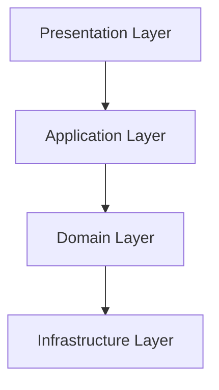

# Clean Architecture Principles for Scalable Web Applications

## Introduction

Clean architecture is not just about writing clean code—it's about creating systems that are maintainable, testable, and adaptable to change. In this article, I'll explore the core principles of clean architecture and how I've applied them to build scalable web applications.

## The Core Principles

### 1. Separation of Concerns



**Key Benefits:**

- Each layer has a single responsibility
- Changes in one layer don't affect others
- Easier to test and maintain

### 2. Dependency Rule

> "Source code dependencies must point only inward, toward higher-level policies."

```typescript
// Good: Domain layer doesn't depend on infrastructure
interface UserRepository {
  findById(id: string): Promise<User>;
}

// Infrastructure implements the interface
class MongoUserRepository implements UserRepository {
  // Implementation details
}
```

### 3. Interface Segregation

```typescript
// Instead of one large interface...
interface UserService {
  createUser(data: UserData): Promise<User>;
  updateUser(id: string, data: Partial<UserData>): Promise<User>;
  deleteUser(id: string): Promise<void>;
  // ... many more methods
}

// Use smaller, focused interfaces
interface UserCreator {
  createUser(data: UserData): Promise<User>;
}

interface UserUpdater {
  updateUser(id: string, data: Partial<UserData>): Promise<User>;
}
```

## Applying Clean Architecture to William64.com

### Layered Structure

```
src/
├── application/    # Use cases and business logic
├── domain/        # Core business entities and rules
├── infrastructure/ # External concerns (DB, APIs, etc.)
└── presentation/  # UI components and delivery mechanisms
```

### Dependency Injection

```typescript
// Domain layer defines interfaces
interface EmailService {
  sendEmail(to: string, subject: string, body: string): Promise<void>;
}

// Infrastructure implements
class SendGridEmailService implements EmailService {
  async sendEmail(to: string, subject: string, body: string) {
    // SendGrid implementation
  }
}

// Application layer uses the interface
class UserRegistration {
  constructor(private emailService: EmailService) {}

  async register(userData: UserData) {
    // Registration logic
    await this.emailService.sendEmail(/* ... */);
  }
}
```

## Benefits I've Experienced

1. **Easier Testing**: Mock dependencies at the interface level
2. **Better Maintainability**: Clear separation makes code easier to understand
3. **Flexibility**: Swap implementations without changing business logic
4. **Scalability**: Add new features without breaking existing ones

## Common Pitfalls to Avoid

1. **Over-engineering**: Don't apply clean architecture to simple projects
2. **Interface explosion**: Too many small interfaces can be hard to manage
3. **Ignoring the dependency rule**: Keep dependencies pointing inward

## Conclusion

Clean architecture principles have been instrumental in building William64.com's scalable, maintainable codebase. By focusing on separation of concerns, proper dependency management, and interface segregation, I've created a system that can evolve without becoming a maintenance nightmare.

[Explore the architecture in detail](/projects/design-system-migration) | [View the codebase](https://github.com/williamsutton/design-system)
